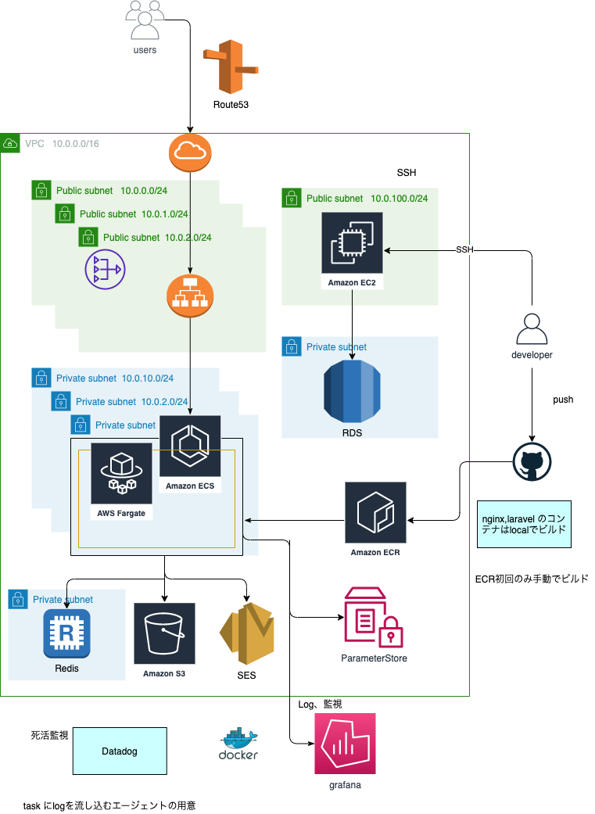

# sample-terraform

### 環境変数をsetする

---

1. .envに値をsetする
``` 
$ cp .env.example .env
```
``` 
注意
TF_VAR_APP_NAME -> 必ず対象アプリケーションのリポジトリ名にすること(小文字ハイフンつなぎ)
TF_VAR_DB_MASTER_NAME,TF_VAR_DB_MASTER_PASS  -> 共にハイフンは使用不可
TF_VAR_DB_NAME -> 文字列+数字にすること (ハイフン,文字列のみは使用不可)
TF_VAR_DOMAIN, TF_VAR_ZONE ->  Route53に登録してあるもの
TF_VAR_LOKI_USER, TF_VAR_LOKI_PASS -> なくても問題ない
```

2. public キーをセットする
```shell:
$ vim ec2/sample-ec2-key.pub
```

### TerraformでAWS環境のbuildする

---
1. Terraform の読み込みと環境の作成
```shell:
$ docker-compose up -d --build
$ make init 
$ make apply

> Apply complete! Resources: 54 added, 1 changed, 0 destroyed!
```

2. ビルドした AWS環境 の環境変数を SSM に設定する
```shell:
// .env.productionに値の書き込み
$ make outputs

> DB_HOST末尾のportだけ削除(:5432 の削除) 

// SSM (パラメーターストア)に値の登録
// .env.production にあるvalueを登録 or 上書き
$ make ssm-store     
```

3. ECRにイメージをpushする
```
// set ECR
$ make ecr-repo
``` 

### アプリケーション側の設定

---
1. .env.githubの環境変数を確認して環境変数を登録する
```shell:
AWS_ACCESS_KEY_ID
AWS_SECRET_ACCESS_KEY
AWS_ACCOUNT_ID  *awsにlogin後、右上の画面を確認すると以下画像のように見れる
SUBNETS   *outputsで確認後 [] 内の内容のみを登録
SECURITY_GROUPS *outputsで確認して登録
LOKI_ID     *コメントアウトで不要
LOKI_SECRET *コメントアウトで不要
```

2. Task-definitionの環境の参照先を注意する
```json:
# SSM に値がある場合
{
    "name": "AWS_ACCESS_KEY_ID",
    "valueFrom": "/SED_TARGET_APP_NAME/ACCESS_KEY_ID"
},

# 登録していない場合
{
    "name": "APP_URL",
    "value": "https://snails8.site"
},
```

## 注意
Q  how to connect ec2 ?
```
$ ssh -i ~/.ssh/秘密鍵 ec2-user@IPアドレス
```

Q.  RDS instance failed to create 
please check .env value
```
https://docs.aws.amazon.com/AmazonRDS/latest/UserGuide/USER_CreateDBInstance.html
・1〜16文字の英数字とアンダースコアを含めることができます。
・その最初の文字は文字でなければなりません。
・データベースエンジンによって予約された単語にすることはできません。

✕: ハイフン(-), ✕:誰もが使いそうなusername=admin (すでに予約されているため)
```

## CI/CD
It is a CI/CD env that does not directly handle credential information
Please be careful if you want to use
```
En
・When copying and pasting, pay attention to the repository specification destination (GHA-terraform.yml)
・Uncomment terraform and workflow in main.tf
・Set the following 3 environment variables on Github

Jp
・コピペする場合はリポジトリ指定先に注意(GHA-terraform.yml)
・main.tf 内の terraform とworkflowのコメントアウトを解除
・以下３つの環境変数をGithub上にセット
```

```
AWS_ROLE_ARN=引き受けるロールのARNを指定。OHA で作成される IAM ロールの ARN
AWS_WEB_IDENTITY_TOKEN_FILE=Web IDトークンファイルへのパス
AWS_DEFAULT_REGION=デフォルトのリージョン。東京リージョンを指定したい場合はap-northeast-1
```

## 運用 注意
ドメインをRoute53に登録していないと怒られるので注意

開発用と本番用で分けたい場合は
variable_des.tf のように分けて運用してください

## 懸念点
github-actionsでアプリケーションのdeployをしているため、task-definition が二重管理になってしまっている。

外部デプロイを利用すれば回避できるが以下の問題がある
- https://docs.aws.amazon.com/ja_jp/AmazonECS/latest/userguide/deployment-type-external.html

対応策

・AWS Copilot を使用
https://docs.aws.amazon.com/ja_jp/AmazonECS/latest/userguide/getting-started-aws-copilot-cli.html

・パイプラインの使用
https://zenn.dev/reireias/articles/8e987af2762eaa

理想
github-actions にCodePipelineをかませる


## ディレクトリ構造

## 構文
### Module
Module: リソースを集約して1つの機能としたもの

Moduleには２種類ある
・Child Module :特定の機能をまとめたもの他mModuleから呼ばれるように設計
・Root Module  :Terraformコマンドを実行するディレクトリにまとめられたTerraformリソースのこと。childに値を渡したり、呼び出したりする

Module は4つのブロックを Terraform ファイルに定義すること作成できる
・resource :Moduleが作成するインフラのリソース
・data     :既存のリソースを参照
・variable :変数
・output   :Moduleの値を外に渡す

### locals 値の使用 
https://www.terraform.io/docs/language/values/locals.html

local values とは
・Local Valuesとはモジュール内に閉じて使える変数 (module内のローカル変数のようなもの)
・tfファイル内の変数は基本的にLocal Valuesを使う
・特に判定処理はLocal Valuesで明確な名前をつけること

variableとの違い
・Local Valuesには関数や他リソースの参照などが書ける (DRY 意識するときとか)
・Local Valuesは外部からの値の設定ができない
・Variableを使うのは外部からのインプットにする場合

* 余談 variable 様々な値の設定方法
・apply実行時に対話的に入力
・コマンドラインから-varオプションや-ver-fileオプションで指定
・terraform.tfvarsファイルで指定
・環境変数(TF_VAR_xxxなど)で指定
・variableの定義時にデフォルト値を明示
つまりvariableは外部から意図しない値が入力される可能性がある。

```terraform
locals {
  load_balancer_count = "${var.use_load_balancer == "" ? 1 : 0}"
  switch_count        = "${local.load_balancer_count}"
}

resource sakuracloud_load_balancer "lb" {
  count = "${local.load_balancer_count}"
}

resource sakuracloud_switch "sw" {
  count = "${local.switch_count}"
}
```
### 注意点
・commaは書くな
Error: Unexpected comma after argument

・main.tfを編集したらinitしろ
